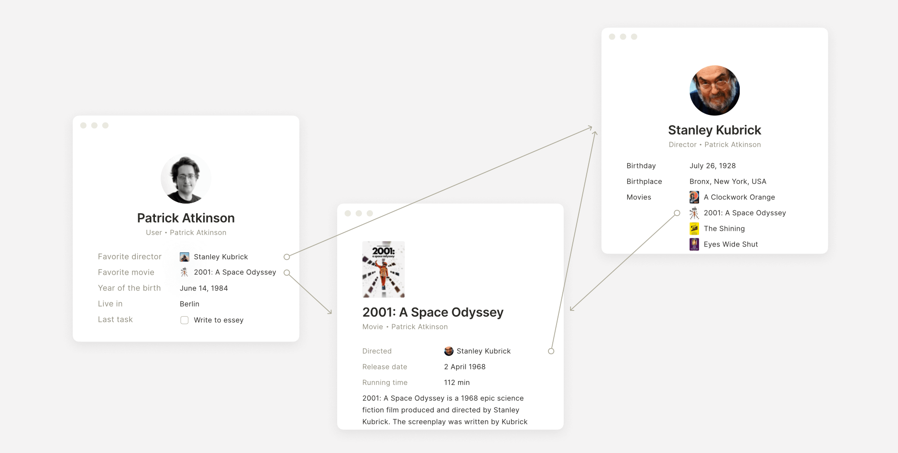

# Relation in practice. Can they act like properties or fields in databases?

[relation.md](../self-onboarding/relation.md "mention") is the foundation of our graph structure. They connect your objects into the knowledge graph. But, you can use them for general purposes. For example:

* You can also use relation to set some «primitive» value like a date, a tag, a status, an email, or a phone number. Later we will update the system where even such values might be presented as Objects.
* Relations can be shown as columns in a “database” / “table” view by using [set.md](../self-onboarding/set.md "mention"). So you can use them as properties in Notion for such case.
* Relations are global. You can change the name, and you will update it everywhere.
* You can add any relation to any object using Blocks, Set or Object’s relation view. Take a look on [#adding-relations](../self-onboarding/relation.md#adding-relations "mention")
