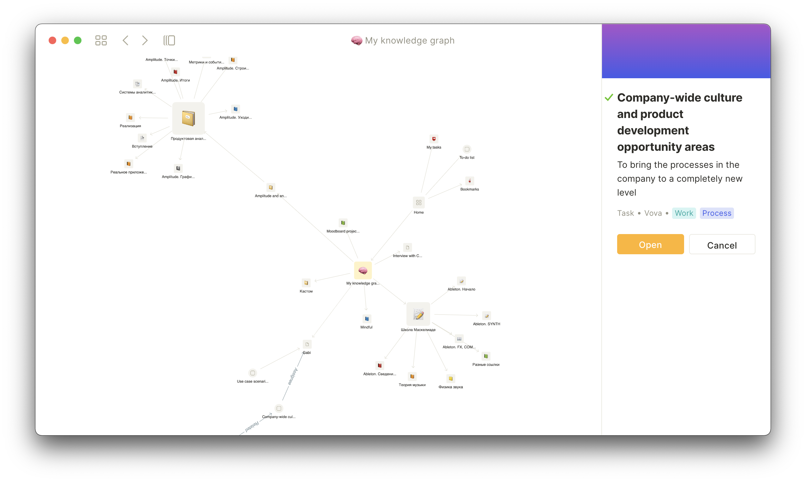

# Relation

## Knowledge Graph

Your objects combine to form a unique knowledge graph. It's a universal data structure and a strong foundation for automation. We want Anytype to be a modular platform for machine learning and plan to release our first modules for the public beta.

## Relations

We use **relations** to connect objects in the graph. They add context and significance to each connection. For instance, Patrick was born in 1984, he lives in Berlin, and he just finished an essay. His favourite band is Pink Floyd, and his favourite movie is _2001: A Space Odyssey_. Patrick connects to each of these with relations like "date of birth," "location," "last task," "band," and "movie."

**Common Relations:**

* **Name** the name of an object.
* **Type:** defines how an object looks and its default relations.
* **Tag:** a typical relation used to label an object for future reference.

### Adding relations

* You can add a relation to the canvas like any other block - with a `+` button or the in-line `/` menu.
* From the relations panel: found in the canvas, next to the object name. This panel shows all relations in that object. Here you can add new relations or modify existing ones.
* You can feature any relation by clicking ★ next to the relation in the relations panel. Featured relations are on the canvas, below the object's name.

### Creating relations

#### **From the library:**

Choose from any relation available in your library. Inside the library, you will find relations created by Anytype and you.

#### **From scratch:**

You can easily create an entirely new relation from scratch. It will then be added to your library, ready for use across your Anytype.

Below is the information on a few of the types available currently:

* **Text:** accepts text as the input.
* **Number:** for all numbers. Different formats are coming soon.
* **Date:** date, optional information for time.
* **Status:** an array of the string with a restriction on the output of only one element.
* **Tag:** another variety of the string with no limits, only one string.
* **Email/phone/URL:** special formats for URL, email, and phone number.
* **Checkbox:** an object with a boolean, string, or link to an object.
* **Media:** audio, movies, or pictures which you can view, play, or download.
* **Object:** reference to a specific object, like a person, task, or document.

> There are many more relations inside of Anytype!


At present, you cannot delete relations. So be careful to avoid duplicate relations with the same name.


### Additional info

* You cannot currently modify relations included with Anytype.
* Some relations are read-only, and you cannot change their value. Relations such as `Created` or `Last modified`. Read-only relations have the  icon next to them.
* If you add a new relation to a Set, Anytype will not add empty values to the relations in that set. However, when you open an object, Anytype will suggest that it relates to you.
* When creating an object, Anytype will display empty values in the list of relations.


Renaming a relation in one object will change its name across all objects.

