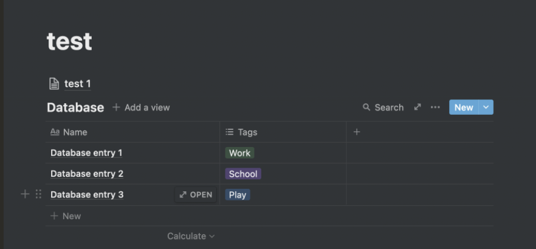

# Missing Features

Anytype is currently in the alpha stage of development, while Notion is in production. Most of the vital core functionality that you'll have used in Notion is in place within Anytype, but essential features are missing and are currently in development.

Read on to find out which core features Anytype does not have in this stage of development compared to Notion. **You'll want to carefully review and understand this information before fully committing to switching your workflow over from Notion to Anytype**. Please note that only **major, core features** will be mentioned in this document.

Take a look at our [Community Forums](http://community.anytype.io) to check out our most voted for feature requests, and maybe even vote and submit requests yourself! We can't wait to hear your feedback and input for Anytype.

***

## Sharing, Publishing and Collaboration

**Notion** allows users to share pages and workspaces with other Notion users. Alternatively, users can create a sharing link to enable users without a Notion account to access your shared content.  (1).png>)

**Anytype** currently cannot share content with other Anytype users or to the web. However, this feature is planned and is on the roadmap. If you find yourself needing to share content with other users, please use the "Print" option, accessed by using your system's Print keyboard shortcut or through the three-dot menu within an object canvas.

## Workspaces

Within **Notion**, users can create multiple workspaces. Workspaces are self-contained and can be shared with other users. Workspaces help separate different aspects of your life within Notion, such as work, personal activities, and school.

Anytype currently does not support workspaces. So you'll have to store all of your objects within one single Anytype account at this moment.

## API and Integrations

[Notion's API](https://developers.notion.com) allows developers and users to create integrations with Notion. Please note that Anytype does not currently have an API or plugins, but it is [on the roadmap](https://community.anytype.io/c/feature-requests/developers-plugins-open-source/12). Please look forward to its release!

## Inline databases (sets)

With **Notion's** inline databases, you can embed a database within an already-existing page.\
\
**Anytype** currently does not feature inline sets (or databases in Notion jargon). It's on the roadmap and will be released with later versions of Anytype.

## More: Advanced Features

Here's a list of advanced Notion features not currently available in Anytype.

* Synced Blocks
* Tree Navigation (Coming Soon)
* Sidebar
* Notifications

## What does this mean for me?

In its current state, Anytype is powerful, and freedom-respecting software, with many cores features that Notion users may be familiar with. However, Anytype and Notion are two entirely different products in two different stages of development, so feature differences are to be expected. As more time and resources are placed in Anytype's growth, you'll find many more features that make the jump over to Anytype.
