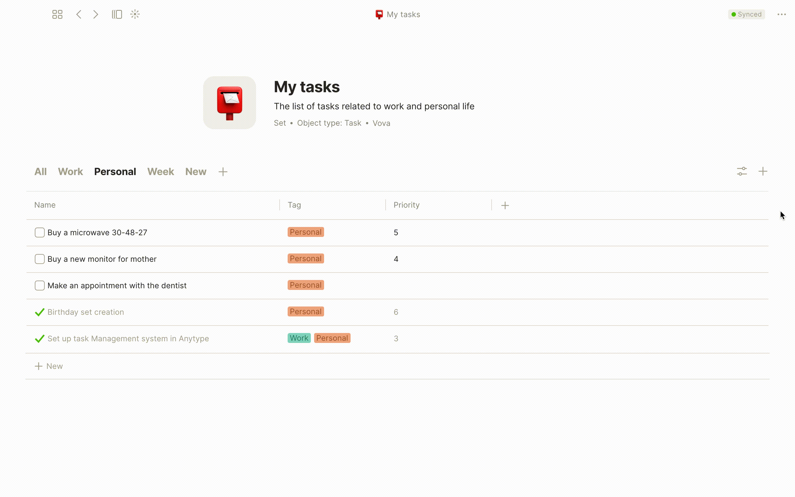

# Creating a Task Tracker

### Steps

1. To create a **Task tracker**, you need to click + on home, choose [set.md](../fundamentals/set.md "mention") and set **Task** as a source. That's it. You just started a task tracker!
2. So now you can view all Tasks in one place. For the Task list, you may add relations. `Tag`, `Due date`, `Priority`, Or any other use for your tracker.
3. You can also use filters, sorts, and views like:
   1. Relation `Done` `Is` `Unchecked` so you will see only those that are not done
   2. Create a view Work and Personal with filters `Tag` `contains` `Work` and `Tag` `contains` `Personal` to separate the lists
   3. Make `Due date` `ascending` to see nearest tasks higher

You can create a **Task** object with the `+` button in-row in your Set, in the editor by typing `/Task`, or using `+` from the dashboard. **All of these objects will be shown in this Set.**

***


Sets collect all your objects that match the given criterion. You can add a new book anywhere inside of Anytype, and it will be shown here!


### Custom type

If you don't like **Relations** and **Templates** used in Task, you can [#create-a-type](../fundamentals/type/#create-a-type "mention") that will fit your needs.

1. You need to open [library.md](../features/library.md "mention") in **Home** screen, which contains all **Types** in Anytype
2. Press "Create a new type."
3. In your custom **Type**, you can choose any relation and create a template you want.
4. To create a **Task tracker**, you need to click "Create" → "New Set of objects."

### Template

It's convenient to create templates for repeatable tasks with pre-filled options. For example, templates related to Work can contain `Tag` `==` `Work` with higher default priority.


Find ideas to spark <mark style="background-color:purple;">inspiration</mark> in [Community Showcases](https://community.anytype.io/c/general-discussion/showcase/13)

