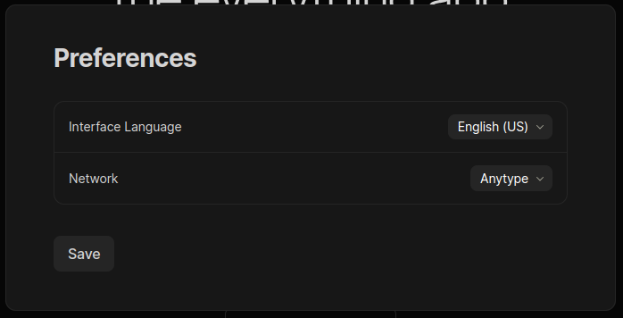

# Capture simple notes

The current tutorial will show you how to organize your notes quickly and quickly.\
You will use a pre-build set-up for Note type, and Notes set

### Create them everywhere

You can create Notes everywhere you want. Every object you create by default is a Note. You can use `+` on Home, `/` in Editor, `+ New` in [set.md](../../self-onboarding/set.md "mention") — all of them will be shown in Notes.

{% embed url="https://files.gitbook.com/v0/b/gitbook-x-prod.appspot.com/o/spaces%2FJbcKxgThRdSa4vZyLbvH%2Fuploads%2F5YUqYWaLY9l1nXxQgQSK%2FNotes%20creation.mp4?alt=media&token=779d9632-8185-42e9-ab8c-56a79c7946bb" %}
"Notes" Set comes with Anytype by default


Sets collect all objects by given criteria. For example, if you add a new Note anywhere inside the Anytype, it will be shown here! By default, it is sorted by creation date.


Click on links to know more about [Broken link](broken-reference "mention"), [set.md](../../self-onboarding/set.md "mention") & [relation.md](../../self-onboarding/relation.md "mention").


### Sort them later

Notes are sorted by "Last modified date" as you had in Apple Notes or Evernote by default.\
Press the setting icon if you want to create other sorts.

.png>)

### Categorizing with tags

Tags let you add keywords to Notes, making them easier to find and browse when you've got a lot of them. Use tags when a note might apply to more than one category or when you want to filter some Notes from all of them. For example, you may create tags for:

* **Personal:** Add a tag for something related to you, like an idea, thought or a grocery list
* **School:** Add a tag for each of your subjects or for individual semesters.
* **Research:** Add a tag for the relevant article, podcast, or book you read. Like `management`, `memorization`, `psychology.`

Make these steps and start your Tags management:

1. You need to add Tag as a column in Set. You can start adding categories in the cells straightaway.\
   .png>) 
2. Add a View related to this particular Tag or Tags. You need to set up a filter with condition like `Tag has any of Personal`\
   .png>) .png>)


You can work with relations everywhere! Check out where and how you can also use Tags: [#adding-relations](../../self-onboarding/relation.md#adding-relations "mention").

